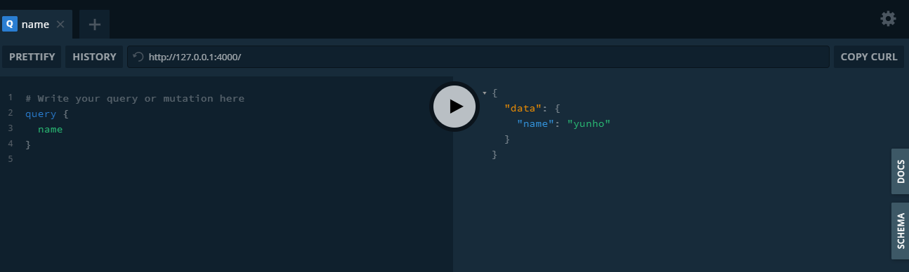
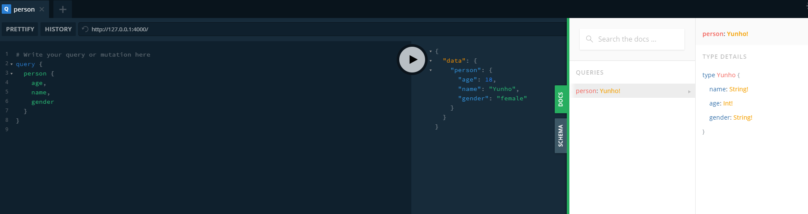
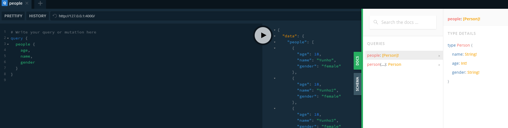
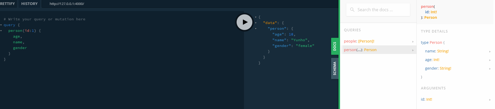
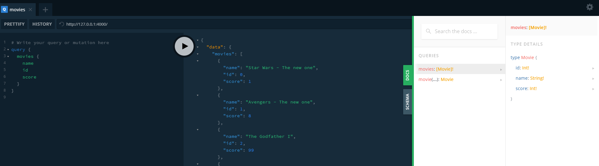
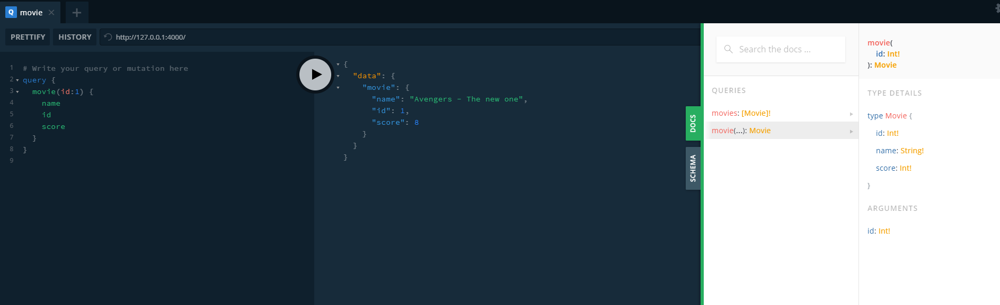
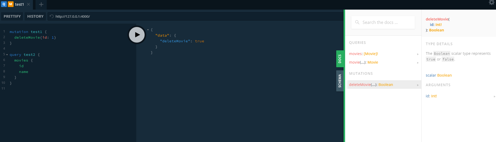
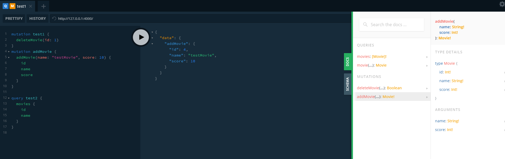

# graphql-study

본 repository는 nomadcoder의 [graphql로 영화 api 만들기 강의](https://nomadcoders.co/graphql-for-beginners)를 참고하여 작성되었습니다.

그런데 이 강의는 orm에대해서는 안다루네요. 열심히 찾아서 orm 연결해보고 테스트 프로젝트 하나 하는 것까지 진행해보겠습니다.

## 참고

서버는 nodejs  
orm은 prisma https://www.prisma.io/
db는 postgre  
api는 graphql  
aws

- lambda
- api-gateway
- rds
- s3

이렇게까지 연결해보자.

좋은듯

https://medium.com/labelstore/prisma%EB%A1%9C-graphql%EC%9D%84-%EC%89%BD%EA%B2%8C-%EB%8F%84%EC%9E%85%ED%95%98%EA%B8%B0-fa64dcf63382
https://www.prisma.io/docs/guides/deployment/deploying-to-aws-lambda

## What GraphQL want to solve?

크게 아래의 두가지 문제를 해결했다고 말을 한다.

- over fetching
- under fetching

### Over Fetching

rest api를 호출할 때를 예를 들어보자.

어떤 유저에 대한 정보를 가져올 때, 가장 처음 화면에서 나오는 유저에 대한 이름을 가져온다고 하자.

rest api는 이때 `/users/` 와같은 api를 호출할 것이며, 이 경우 이름을 제외한 다른 정보들은 가져오지만 (`fetching`) 사용하지 않게 된다. 예를 들자면 주소나 성별 정보, 프로필 사진 정보등이 이에 해당한다.

이럴 경우 Database가 쓸데 없는 영역을 보게 만들고, 고객들이 앱에서 필요도 없는 정보들을 받아 버리게 된다.

이러한 문제를 **over fetching**이라고 한다.

### Under Fetching

인스타그램을 예로들어 보자.

인스타 그램에는 한 페이지에 feed 정보나 알람정보, 유저의 정보 등이 한꺼번에 필요로 하는데, 이럴 경우 아래와 같은 rest api의 호출이 필요할 것이다.

- `/feed/`
- `/notifications/`
- `/user/1`

## How to solve?

QraphQL에서는 이러한 문제를 클라이언트가 필요로하는 정보를 한꺼번에 요청할 수 있게 함으로서 해결한다.

Over Fetching 문제의 경우 아래와 같이 query를 날리면

```graphql
query {
  user {
    name
  }
}
```

아래와 같이 response가 온다.

```graphql
{
  user: {
    name: "yunho"
  }
}
```

Under Fetching 의 경우 아래와 같이 여러개의 쿼리를 동시에 날릴 수 있게함으로서 해결한다.

```graphql
query {
  feed {
    comments
    linkeNumber
  }
  notifications {
    isRead
  }
  user {
    username
    profilePic
  }
}
```

위 와 같이 여러 종류의 쿼리를 동시에 날릴 수 있고, 아래와 같이 response를 받아볼 수 있다.

```graphql
{
  feed : [
    {
      comments: 1,
      linkeNumber: 20
    }
  ],
  notifications : [
    {
      isRead: true
    },
    {
      isRead: false
    }
  ],
  user : {
    username: "yunho"
    profilePic: "http://example.com/pic.jpg"
  }
```

좋은 점은 request와 response의 전송이 매우 유사한 꼴을 뛰기 때문에 읽기 편리한것도 같다.

## 설정

### 설치

```console
npm install --global yarn
yarn add @babel/cli @babel/core @babel/node @babel/preset-env graphql-yoga
yarn add babel-preset-env babel-preset-stage-3
```

### babelrc 설정

`.bablerc`

```json
{
  "presets": ["@babel/preset-env"]
}
```

### package.json 작성

`package.json`

```json
{
  "name": "graphql-study",
  "version": "1.0.0",
  "description": "Movie API with Graphql - nomadcoders",
  "repository": "https://github.com/choiking10/graphql-study",
  "author": "Yunho Choi <choiking10@gmail.com>",
  "type": "module",
  "license": "MIT",
  "dependencies": {
    "@babel/cli": "^7.12.10",
    "@babel/core": "^7.12.10",
    "@babel/node": "^7.12.10",
    "@babel/preset-env": "^7.12.11",
    "graphql-yoga": "^1.18.3"
  },
  "scripts": {
    "start": "nodemon --exec babel-node index.js"
  },
  "devDependencies": {
    "babel-preset-env": "^1.7.0",
    "babel-preset-stage-3": "^6.24.1"
  }
}
```

### GraphQL 수정시에도 nodemon 작동하도록 수정하는 법

project root에 `nodemon.json` 파일 생성

```json
{ "ext": "js json jsx graphql" }
```

nodemon 재시작

## Query and Resolver

어쨌든 CRUD 연산인데 `Query`는 Read에 해당함.
즉 Query는 Database로부터 정보를 얻는것으로 정보를 받을 때 사용함.

Create Uupdate Delete에 해당하는 것은 `Mutation`임.
Mutation은 Database에서, 혹은 메모리에서 정보를 바꾸는 작업을 할 때 사용함.

### Query

schema.graphql

```graphql
type Query {
  name: String!
}
```

resolvers.js

```js
const resolvers = {
  Query: {
    name: () => "yunho",
  },
};

export default resolvers;
```

index.js

```js
//...
import resolvers from "./graphql/resolvers.js";
//...
const server = new GraphQLServer({
  typeDefs: "./graphql/schema.graphql",
  resolvers,
});
//...
```

이제 `yarn start`를 수행한후 `127.0.0.1:4000` 에 들어가보자.


awesome!

## Playground

Playground는 graphql yoga에 딸려오는건데 postman 같은거야.

다음과 같이 Object type을 생성해보자.

```graphql
type Yunho {
  name: String!
  age: Int!
  gender: String!
}

type Query {
  person: Yunho!
}
```

```js
const yunho = {
  name: "Yunho",
  age: 18,
  gender: "female",
};

const resolvers = {
  Query: {
    person: () => yunho,
  },
};
```

그리고 다시 playground를 실행한후 docs를 확인해보면



편하게 api가 생성되고, 이를 확인할수도있어.

awesome!

조금 더 복잡한 쿼리를 만들어보자.  
다음과같이 쿼리의 결과로 array를 넘겨줄수도 있고, 인자로 어떤 것들을 받을 수도 있어.

```graphql
type Person {
  name: String!
  age: Int!
  gender: String!
}

type Query {
  people: [Person]!
  person(id: Int!): Person
}
```

이렇게 할경우 다음과 같이 여러개의 array에 대한 결과물을 받을 수 있지.



이제 argument를 받는 것을 해보자.

```js
const getById = (id) => {
  const filteredPerson = people.filter((person) => id == person.id);
  return filteredPerson[0];
};

const resolvers = {
  Query: {
    people: () => people,
    person: (_, args) => {
      return getById(args.id);
    },
  },
};
```

resolver에 person에 관한 쿼리가 오면 args 에서 받아서 처리할 수 있어.
위와같이 설정하면 말이야.
굳잡맨



resolver는 View 같은것이고, Schema는 URL 같은거야.

## Defining Mutations

이제 수정할 수있도록 만들어보자.

그전에 db 같은것들을 만들어서 붙여보도록 하자. 코드는 배울게없으니까 첨부하지 않을께.

대충 아래와같은것들이되면 되겠찌.





이렇게 만들어두고, Mutation을 만들어보자.

schema.graphql

```graphql
type Mutation {
  deleteMovie(id: Int!): Movie!
}
```

resolvers.js

```js
const resolvers = {
  Query: {
    movies: () => getMovies(),
    movie: (_, { id }) => getById(id),
  },
  Mutation: {
    deleteMovie: (_, { id }) => deleteMovie(id),
  },
};
```



super simple~

조금더 어려운 addMovie를 만들어볼까?

일단 schema에 대해서 정의

```graphql
type Mutation {
  deleteMovie(id: Int!): Boolean
  addMovie(name: String!, score: Int!): Movie!
}
```

db에 addMovie를 간단히 구현해보자

```js
export const addMovie = (name, score) => {
  let last_id = movies
    .map((movie) => movie.id)
    .reduce((max, cur) => Math.max(max, cur));
  let cur_id = last_id + 1;
  let newMovie = {
    id: cur_id,
    name: name,
    score: score,
  };
  movies.push(newMovie);
  return newMovie;
};
```

그리고 resolver를 수정해줘야겠지

```js
const resolvers = {
  Query: {
    movies: () => getMovies(),
    movie: (_, { id }) => getById(id),
  },
  Mutation: {
    addMovie: (_, { name, score }) => addMovie(name, score),
    deleteMovie: (_, { id }) => deleteMovie(id),
  },
};
```



TADA~
